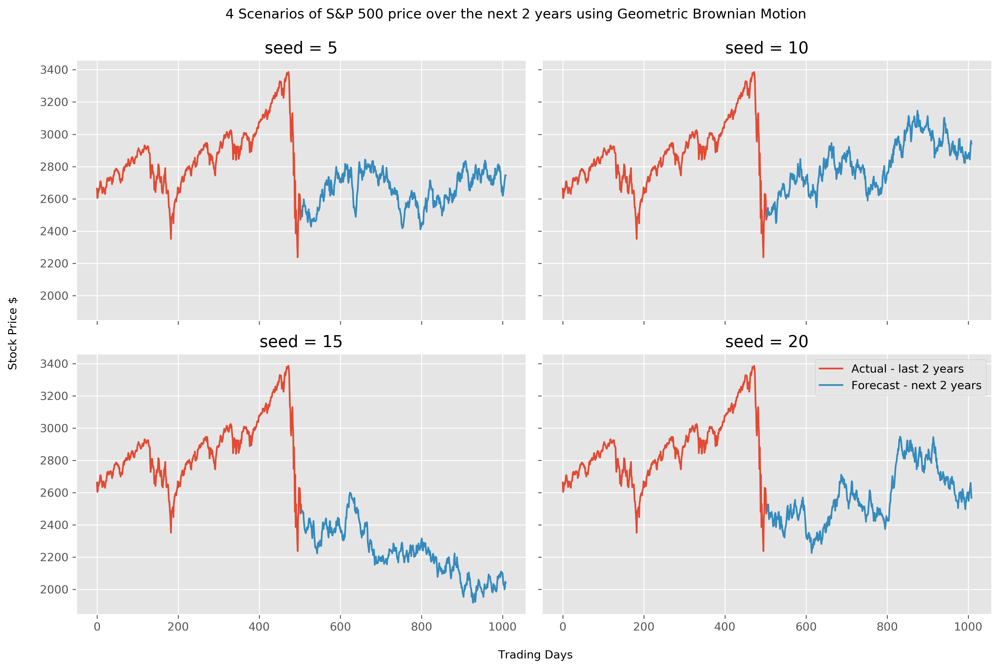

# S-P-500-Forecast-Using-Geometric-Brownian-Motion-Simulation
Simulating multiple S&amp;P 500 stock price movement using stochastic calculus.

GEOMETRIC BROWNIAN MOTION

Plot multiple stock forecast using GBM.

# Parameter Definitions

  So    :   initial stock price
  dt    :   time increment -> a day in our case
  T     :   length of the prediction time horizon(how many time points to predict, same unit with dt(days))
  N     :   number of time points in the prediction time horizon -> T/dt
  t     :   array for time points in the prediction time horizon [1, 2, 3, .. , N]
  mu    :   mean of historical daily returns (drift coefficient)
  sigma :   standard deviation of historical daily returns (diffusion coefficient)
  b     :   array for brownian increments
  W     :   array for brownian path

# Sample Output
  
